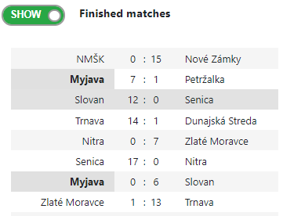
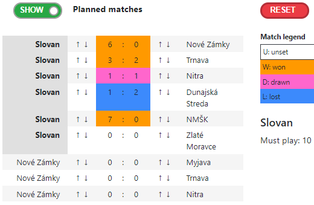

# estimateScore

The ``estimateScore`` script is for creating and displaying league season tables from match results. It can be used for all kinds of sports, like football, floorball, etc. which are played seasonally. It is written as ``AngularJS`` script.

## Key features

### 1. Results Summary

The ``estimateScore`` will calculate the positions of the teams itself. You may update the results and view the table changed according to the modifications.

### 2. Score estimation

As the main feature of the ``estimateScore`` is ''view the future results''. You can simulate the results of planned matches for your favorite team and view the changes in the table immediately.

## Web page
Some illustrations of the script capabilities you can see on the [exhibition webpage](https://mezek.github.io/estimateScore "EstimateScore webpage").

| Copyright (c) 2018-2019 Erik Bartoš
